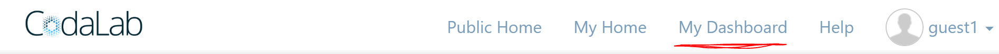
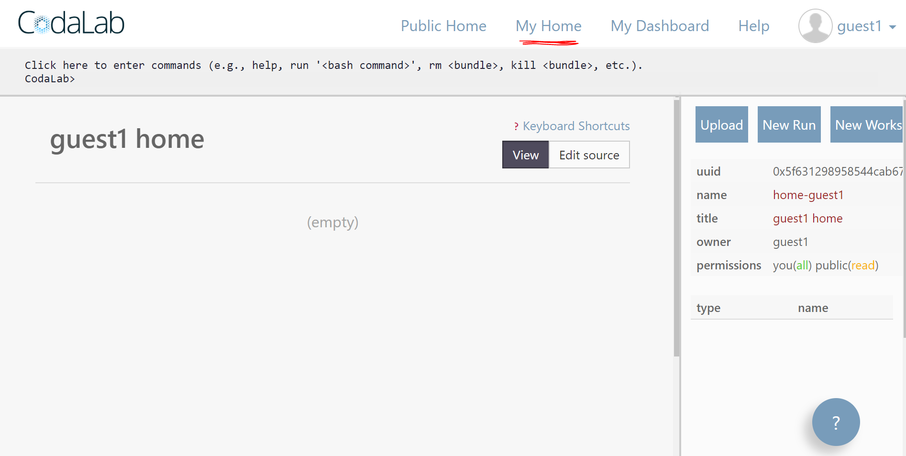
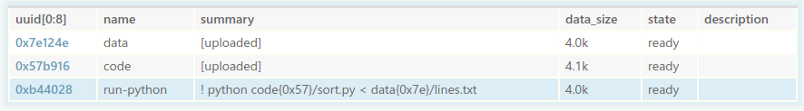

# Tutorial: Quickstart

**Estimated time:** 15 minutes

In this tutorial, you will create a CodaLab account, install the CodaLab CLI,
upload some code and data, and run your first experiment.

## 1. Create an account

1.  Go to [http://worksheets.codalab.org](http://worksheets.codalab.org) and click "Sign Up" in the top-right corner.
2.  Fill out the subsequent form.
3.  A verification email will be sent to the email address you used to sign up. When you open it, there will be a link to follow in order to verify your account.
4.  After verifying your account, sign in again. This will bring you to "My
Dashboard". This is a **special, read-only worksheet** that contains an
overview of your bundles and worksheets. You can get back to this
page at any time by clicking the "My Dashboard" button in the top-right.

5.  Click on the "My Home" button in the top right. This will bring you to your
**home worksheet** (called `home-<username>`). This worksheet is yours to
customize.

## 2. Install the CLI

You can do many things from the web interface,
but to be truly productive on CodaLab, you should install
the CodaLab command-line interface (CLI).
We assume you already have Python and pip installed.
Open a terminal and run the following:

    $ pip install codalab -U --user

*Note.*  The CLI only works with Python 2.7 right now, so if Python 3 is your default, you can install CodaLab into a virtual environment:

    $ virtualenv -p python2.7 venv
    Running virtualenv with interpreter /usr/bin/python2
    ...
    $ . venv/bin/activate
    (venv) $ pip install codalab -U

*Note.* If you are in the Stanford NLP group, you can ssh into the NLP cluster,
where the CodaLab CLI should already be installed (`/u/nlp/bin/cl`).

To login from the CLI, type:

    $ cl work
    Requesting access at https://worksheets.codalab.org
    Username: guest1
    Password:
    Currently on worksheet https://worksheets.codalab.org::home-guest1(0x39729afdca6140869a11e055e4cc0649).

The CLI is associated with a **current worksheet**, which is by default pointed
to your home worksheet (`home-<username>`).

## 3. Uploading files

We will now run your first experiment in CodaLab.  We will run a simple Python
script that simply sorts the lines of a text file.

Locally, make sure you stay in the `worksheets-examples/00-quickstart` directory for the rest of this tutorial:

    $ cd 00-quickstart

In our example, the `data` and `code` directories have the following contents:

`data/lines.txt`:

    e
    d
    c
    b
    a

`code/sort.py`

    import sys
    for line in sorted(sys.stdin.readlines()):
    	  print line,

We can upload the `data` and `code` as two separate bundles.  Each command outputs the UUID of the bundle that was created,
a globally unique identifier that you can use to refer to that particular bundle.
By default, the name of the bundle (which need not be unique) is the name of the file/directory you're uploading (which can be overridden with `-n <name>`).

    $ cl upload data
    Preparing upload archive...
    Uploading data.tar.gz (0x47041bd9565941f38a001b705a90c502) to https://worksheets.codalab.org
    Sent 0.00MiB [0.00MiB/sec]
    0x47041bd9565941f38a001b705a90c502
    $ cl upload code
    Preparing upload archive...
    Uploading code.tar.gz (0xb536a6447bbe4ec797054d38667384ce) to https://worksheets.codalab.org
    Sent 0.00MiB [0.00MiB/sec]
    0xb536a6447bbe4ec797054d38667384ce

Refresh the web interface (shift-R) to see the data and code bundles:

You can look at their contents and other information in the side panel.

## 4. Running an experiment

Now we're going to create a run bundle that executes the code on the data:

    $ cl run :data :code 'python code/sort.py < data/lines.txt'
    0xea46dbb112444eb1aba285623cbe433f

In this command, `:data` and `:code` specify the dependencies, and the command
is the arbitrary shell command that will be run.
When CodaLab executes this command, it will mount the dependencies `data` and `code` to the particular bundles that their names refer to, like this:

    data -> 0x47041bd9565941f38a001b705a90c502
    code -> 0xb536a6447bbe4ec797054d38667384ce

In the web interface, you can see the run going:

Congratulations, you just created your first experiment in CodaLab!
To do a real NLP task, go to the [next tutorial](../01-nli).
