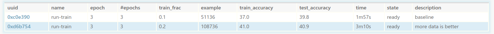

# Tutorial: Natural Language Inference

**Estimated time:** 30 minutes

This tutorial shows you how to use CodaLab to run and manage your experimental
development cycle on a real natural language processing task.

In particular, we will focus on the task of *natural language inference*,
where given two sentences A and B, the goal is to determine whether A entails
B, A contradicts B, or A is neutral with respect to B.  For example, the
following two sentences are contradictory:

> A: The black racecar passes a crowd of people.
>
> B: The vehicle drives down a lonely road.

We will run [Facebook Research's
InferSent](https://github.com/facebookresearch/InferSent) model on the
[Stanford Natural Language Inference
(SNLI)](https://nlp.stanford.edu/projects/snli/) dataset.

## 1. Setup

We assume you have already created a CodaLab account and installed the CodaLab CLI.
If not, go through [the quickstart](https://github.com/codalab/worksheets-examples/blob/master/00-quickstart/README.md) first.
We also assume that you are using Python 2 as default (or are working in a virtualenv with Python 2).

In what follows, `<username>` will stand for your CodaLab username (e.g.,
`<username>-nli` means `pliang-nli` if you are `pliang`).

**Create a new worksheet.**
Create a new worksheet for this tutorial called `<username>-nli`:

    $ cl new <username>-nli
    0x1c511a83993e4602860f207b6c3bd75e

Worksheets are similar to Jupyter notebooks.  For every project, I typically make a
new worksheet every few weeks, which acts like my research log that I append to
for that time period.

**Switch to the worksheet.**
The CLI keeps track of a current worksheet (like a working directory).  Change
it to the worksheet you just created:

    $ cl work <username>-nli
    Switched to worksheet https://worksheets.codalab.org::pliang-nli(0x1c511a83993e4602860f207b6c3bd75e).

Locally, make sure you stay in the `worksheets-examples/01-nli` directory for the rest of this tutorial:

    $ cd 01-nli

In the [web interface](https://worksheets.codalab.org), click "My Dashboard" in
the upper right, click on the `<username>-nli` worksheet.  We will do most things
from the CLI, but the web interface offers a more graphical view of what's happening.

## 2. Data and code

### 2.1. Upload the SNLI dataset

Normally, you would have a dataset lying around, but for the purposes of the tutorial,
we'll download one (SNLI) and put it in the `SNLI` directory on your local disk (~69 MB unzipped):

    $ ./get_datasets.sh
    Downloading SNLI dataset...
    ...
    Splitting SNLI dataset...

Now upload this `SNLI` dataset to CodaLab (the description `-d` is optional and
can be added later, but it's good style to document your bundles):

    $ cl upload SNLI -d "Stanford Natural Language Inference (SNLI) dataset (Bowman et al. 2015)"
    Preparing upload archive...
    Uploading SNLI.tar.gz (0xda98c1500d044b32820173c162f63656) to https://worksheets.codalab.org
    Sent 10.47MiB [1.71MiB/sec]
    0xda98c1500d044b32820173c162f63656

Refresh the web interface (shift-R) to see this new bundle appear on the worksheet.

### 2.2. Use existing word vectors

We also want to use pre-trained word vectors for our experiments, but
these can be quite large (~5 GB).  Fortunately, CodaLab allows you to leverage
existing bundles that have already been uploaded to CodaLab.
You can simply add any bundle that exists on CodaLab to your worksheet (remember that worksheets
simply contain pointers to bundles).  For this tutorial, let's add the
[GloVe](https://nlp.stanford.edu/projects/glove/) word vectors from the
[word-vectors](https://worksheets.codalab.org/worksheets/0xc946dfbd2215486493672a5e5b0c88d8/) worksheet:

    $ cl add bundle word-vectors//glove.840B.300d .

Refresh the web interface (shift-R) to see this bundle appear.

### 2.3. Upload the code

Now, we upload the code, which is in the `src` directory.  This code is a
minor modification of
[InferSent](https://github.com/facebookresearch/InferSent) to have additional logging.

    $ cl upload src -d "Facebook InferSent code (Conneau et al. 2017)"
    Preparing upload archive...
    Uploading src.tar.gz (0x366e790ab6ba4a728fd32b551a17d555) to https://worksheets.codalab.org
    Sent 0.05MiB [0.12MiB/sec]
    0x366e790ab6ba4a728fd32b551a17d555

Refresh the web interface (shift-R), and you should see three bundles now, the
SNLI dataset, the word vectors, and the code:


**Summary.**  In general, you should try to keep your local working directory
(`01-nli` in this case) and your CodaLab worksheet (`<username>-nli`) in sync.
Unlike Git, you have to organize
your files into directories and upload them into bundles.  A good rule of
thumb is to have one (or more) dataset bundles (e.g., `SNLI`) and a single
bundle for your code (e.g., `src`).

## 3. Running experiments

Now we get to the fun part: actually running the code on the data that we've
uploaded.

### 3.2. Run script

While it is possible to invoke `cl run` directly from the shell, but in practice,
command-line arguments get long and become hard to remember, so we recommend
that you use a *run script* which you can invoke and change easily.

For the tutorial, we have provided a [train.sh](./train.sh) script that you can
invoke simply as follows:

    $ ./train.sh
    cl run --request-docker-image codalab/default-gpu --request-gpus 1 :src :SNLI word-vectors.txt:glove.840B.300d 'python src/train_nli.py --nlipath SNLI --word_emb_path word-vectors.txt --train_frac 0.1 --n_epochs 3'
    0xc0e39088294943d2b22feb9a7f6b7212

This creates a CodaLab bundle, which will be run asynchronously on a worker somewhere.
Refresh the web interface (shift-R), and you should see your training run bundle (`run-train`)
should be going.  You can inspect the stdout and various other information
about the run in the side panel.
It's `state` should go from `created` to `staged` (waiting for a worker) to
`preparing` (downloading files to worker) to `running` (actually running the
job on the worker) to `finalizing` (uploading results from the worker) to
`ready` (finished!).  This should all take less than 5 minutes.

If your bundle is stuck in `staged` for a long time, this could be because you requested
more resources than any worker has, or there are no workers available,
or the workers might be down for some reason.  If you feel like there is a problem,
email support from the worksheet by clicking the "?" icon in the lower right of
the web interface.

You can go and start another training run, which should run in parallel:

    $ ./train.sh --train_frac 0.2
    cl run --request-docker-image codalab/default-gpu --request-gpus 1 :src :SNLI word-vectors.txt:glove.840B.300d 'python src/train_nli.py --nlipath SNLI --word_emb_path word-vectors.txt --train_frac 0.2 --n_epochs 3'
    0xd6b754041338498a835775a41a75b9ef

Note that this run will have the same name.  Names do not have to be unique.
By default, referring to a bundle by name `run-train` will grab the last bundle
with that name, though it is always possible to refer to a bundle uniquely
using the UUID.

### 3.3. Monitoring your runs

While you can look at the output files of each run individually, when you have
10+ runs going at once, it is convenient to display a table summarizing the
results.  The InferSent code has been modified to output two JSON files:
`args.json`, which contains the command-line flags to the run (e.g.,
`train_frac`) and `stats.json`, which contains key statistics (e.g., accuracy),
which are output as the run continues.

For example, this is what the `args.json` looks like:

    {
      "n_enc_layers": 1,
      "word_emb_dim": 300,
      "word_emb_path": "word-vectors.txt",
      ...
    }

This is what the `stats.json` looks like:

    {
      "epoch": 3,
      "example": 51136
      "loss": 1.097785596847534,
      "train_accuracy": 37.0,
      "dev_accuracy": 39.13838650680756,
      "test_accuracy": 39.80048859934853,
      "sentences_per_second": 2061.0820971673384,
      "words_per_second": 119996.1259894223,
    }

We can ask CodaLab to display this information for each run by creating a custom table *schema*.
In the web interface, click "Edit Source" and paste the following at the top of the worksheet
(read more on [schemas](https://github.com/codalab/codalab-worksheets/wiki/Worksheet-Markdown#schemas)):

    % schema run
    % add uuid uuid '[0:8]'
    % add name
    % add encoder /args.json:encoder_type %s
    % add epoch /stats.json:epoch %d
    % add '#epochs' /args.json:n_epochs %d
    % add train_frac /args.json:train_frac %s
    % add example /stats.json:example %d
    % add train_accuracy /stats.json:train_accuracy %.1f
    % add test_accuracy /stats.json:test_accuracy %.1f
    % add time time duration
    % add state
    % add description

This tells CodaLab to create the above table columns when you activate the
schema `run` (you can use any name you want).
Now we can apply the `run` schema to certain bundles by putting the `% display
table run` directive right before the desired bundles.

Click "Edit Source" to make your markdown look like this:

    [dataset SNLI]{0xda98c1500d044b32820173c162f63656}
    [dataset glove.840B.300d]{0x58947c280ae341b9b270fcc2173dc951}
    [dataset src]{0xa0293ba9a5da4e9ca5b84823ec8d5842}

    % display table run
    [run run-python -- :src,:SNLI,word-vectors.txt:glove.840B.300d : python src/train_nli.py --nlipath SNLI --word_emb_path word-vectors.txt --train_frac 0.1 --n_epochs 3 ]{0xc0e39088294943d2b22feb9a7f6b7212}
    [run run-python -- :src,:SNLI,word-vectors.txt:glove.840B.300d : python src/train_nli.py --nlipath SNLI --word_emb_path word-vectors.txt --train_frac 0.1 --n_epochs 3 --train_frac 0.2]{0xd6b754041338498a835775a41a75b9ef}

If you hit "Save", your worksheet should look like this:



You can delete any runs you don't want by right clicking the bundle in the table.

**Mounting.**
While one can view all the results in the browser, sometimes it can be
convenient to be able to run custom scripts that plot the results of an
experiment.  CodaLab allows one to *mount* any bundle so that it appears on
your filesystem as a read-only directory.  Then you can just go into that
directory and visualize things or run a plotting script.

    $ mkdir run-train
    $ cl mount run-train --mountpoint run-train &
    BundleFUSE mounting bundle 0xc79873073b4e4cd7ae76a05714b19042 on /home/pliang/worksheets-examples/01-nli/run-train
    BundleFUSE will run and maintain the mounted filesystem in the foreground. CTRL-C to cancel.

You can now go into the directory and plot some training curves:

    $ pip install matplotlib
    $ python plot.py --logpath run-train/log.json

When you're done, remember to unmount.

### 3.4. Modify the code and re-run

Now you will typically enter a development cycle where you modify your code and
re-run experiments. Every time you make changes, you will upload your code and
run your experiment(s):

    $ cl upload src
    $ ./train.sh

Go ahead and do this now. For example, you can add another layer to the
`ConvNetEncoder` in `src/models.py`(lines 666+):

```python
class ConvNetEncoder(nn.Module):
    def __init__(self, config):
        ...
        self.convnet5 = nn.Sequential(
            nn.Conv1d(2*self.enc_lstm_dim, 2*self.enc_lstm_dim, kernel_size=3,
                      stride=1, padding=1),
            nn.ReLU(inplace=True),
            )
    def forward(self, sent_tuple):
        ...
        sent = self.convnet5(sent)
        u5 = torch.max(sent, 2)[0]

        emb = torch.cat((u1, u2, u3, u4, u5), 1)
        return emb
```

Don't forget to increase the (unfortunately hard coded) encoding dimension in `src/models.py`(line ~753 now):

```python
class NLINet(nn.Module)
    def __init__(self, config):
    ...
    self.inputdim = 5*self.inputdim if self.encoder_type in \ # Make it 5 instead of 4
    ...
```

Then, just upload and run your code:

    $ cl upload src
    $ ./train.sh --encoder_type ConvNetEncoder

## 4. Share your results

By default, worksheets are public to the world.  In the web interface, you can
see this as `permissions: you(all) public(read)`.  So in order to share a worksheet,
you just need to send people the link to either a worksheet or a bundle or a
particular file in a bundle.  The fact that bundle UUIDs (e.g.,
0xa0293ba9a5da4e9ca5b84823ec8d5842) are stable means that you can point people
to things in CodaLab.

**Congratulations** on running your first real experiment in CodaLab!  You can
use this tutorial as a template for future projects.
