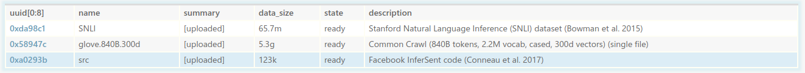

# Tutorial 01: Natural Language Inference

--------------------------------------------------------------------------------

**Estimated Time:** 30 minutes

This tutorial provides a realistic example of how to use CodaLab to run
eperiments on a natural language processing task.
In particular, we will focus on the task of *natural language inference*,
where given two sentences A and B, the goal is to determine whether A entails
B, A contradicts B, or A is neutral with respect to B.  For example, the
following two sentences are contradictory:

> A: A black race car starts up in front of a crowd of people.
>
> B: A man is driving down a lonely road.

We will running [Facebook Research's InferSent](https://github.com/facebookresearch/InferSent) model on the
[Stanford Natural Language Inference (SNLI)](https://nlp.stanford.edu/projects/snli/) dataset.

## 1. Setup

We assume you have already created a CodaLab account and installed the CodaLab CLI.
If not, go through [00-quickstart](https://github.com/codalab/worksheets-examples/blob/master/00-quickstart/README.md) first.

In what follows, `<username>` will stand for your CodaLab username (e.g.,
pliang).

**Create a new worksheet.**
Create a new worksheet for this tutorial called `<username>-nli`:

        $ cl new <username>-nli
        0x1c511a83993e4602860f207b6c3bd75e

Worksheets are like Jupyter notebooks.  For every project, I typically make a
new worksheet every few weeks, which acts like my research log.

**Switch to the worksheet.**
The CLI has a current worksheet (like a working directory).  Change it to be
the worksheet you just created:

        $ cl work <username>-nli
        Switched to worksheet https://worksheets.codalab.org::pliang-nli(0x1c511a83993e4602860f207b6c3bd75e).

Locally, make sure you stay in the `01-nli` directory for the rest of this tutorial:

        $ cd 01-nli

In the [web interface](https://worksheets.codalab.org), click "My Dashboard" in
the upper right, click on the `<username>-nli` worksheet.  We will do most things
from the CLI, but this will offer a more graphical view of what's happening.

## 2. Data and code

### 2.1 Upload the SNLI dataset

Normally, you would have a dataset lying around, but for the purposes of the tutorial,
we'll download one (SNLI) and put it in the `SNLI` directory on your local disk (~69 MB unzipped):

        $ ./get_datasets.sh
        Downloading SNLI dataset...
        ...
        Splitting SNLI dataset...

Now upload the `SNLI` dataset to CodaLab:

        $ cl upload SNLI -d "Stanford Natural Language Inference (SNLI) dataset (Bowman et al. 2015)"
        Preparing upload archive...
        Uploading SNLI.tar.gz (0xda98c1500d044b32820173c162f63656) to https://worksheets.codalab.org
        Sent 10.47MiB [1.71MiB/sec]
        0xda98c1500d044b32820173c162f63656

Refresh the web interface (shift-R) to see this new bundle appear on the worksheet.

### 2.2 Use existing word vectors

We also want to leverage pre-trained word vectors, but these can be quite large (~5
GB).  Fortunately, CodaLab allows you to leverage existing bundles directly on
CodaLab.  You can simply add any bundle that exists on CodaLab to your worksheet (remember that worksheets
simply contain pointers to bundles).  For this tutorial, let's add the GloVe word vectors from the
[word-vectors](https://worksheets.codalab.org/worksheets/0xc946dfbd2215486493672a5e5b0c88d8/) worksheet:

        $ cl add bundle word-vectors//glove.840B.300d .

Refresh the web interface (shift-R) to see this bundle appear.

### 2.3 Upload the code

Now, upload the code, which is in the `src` directory:

        $ cl upload src -d "Facebook InferSent code (Conneau et al. 2017)"
        Preparing upload archive...
        Uploading src.tar.gz (0x366e790ab6ba4a728fd32b551a17d555) to https://worksheets.codalab.org
        Sent 0.05MiB [0.12MiB/sec]
        0x366e790ab6ba4a728fd32b551a17d555

Refresh the web interface (shift-R), and you should see three bundles now:

**Summary.**  In general, you should try to keep your local directory (probably
from Git) and your CodaLab worksheet in sync.  Unlike Git, you have to group
your files into bundles, which should not be too big or small.  A good rule of
thumb is to have one or more dataset bundles (e.g., `SNLI`) and a bundle for
your code (e.g., `src`).

## 3. Running experiments

Now we get to the fun part: actually running experiments.

### 3.2 Run script

While it is possible to directly invoke `cl run` from the command-line, but in practice,
command-line arguments get long and hard to remember, so we recommend that you use
a *run script* which you can invoke easily.

For the tutorial, we have provided a [train.sh](./train.sh) script that you can invoke simply as follows:

        $ ./train.sh
        cl run --request-docker-image codalab/default-gpu --request-gpus 1 :src :SNLI word-vectors.txt:glove.840B.300d 'python src/train_nli.py --nlipath SNLI --word_emb_path word-vectors.txt --train_frac 0.1 --n_epochs 3'
        0x813d9d14e50f41a192778462bf30cbaf

This creates a CodaLab bundle, which will be run asynchronously.
Refresh the web interface (shift-R), and you should see that your training run
should be going.  You can inspect the stdout and various other information
about the run in the side panel.
It's `state` should go from `created` to `staged` (waiting for a worker) to
`preparing` (downloading files to worker) to `running` (actually running the
job) to `ready` (finished!).  This should all take less than 5 minutes.

You can go and start another training run, which should run in parallel:

        $ ./train.sh --train_frac 0.3

### 3.3 Monitoring your runs

While you can look at the output files of each run individually, when you have
10+ runs going at once, it is convenient to display a table summarizing the
results.  The InferSent code has been modified to create two JSON files:
`args.json`, which contains the command-line flags to the run (e.g.,
`train_frac`) and `stats.json`, which contains key statistics (e.g., accuracy).

For example, this is what the `args.json` looks like:

And this is what the `stats.json` looks like:

We can ask CodaLab to display this information for each run by creating a table  *schema*.
In the web interface, click "Edit Source" and paste the following at the top of the worksheet:
(read more on [schemas](https://github.com/codalab/codalab-worksheets/wiki/Worksheet-Markdown#schemas)):

        % schema run
        % add uuid uuid [0:8]
        % add name
        % add epoch /stats.json:epoch
        % add #epochs /args.json:n_epochs
        % add train_frac /args.json:train_frac
        % add example /stats.json:example
        % add train_accuracy /stats.json:train_accuracy %.3f
        % add test_accuracy /stats.json:test_accuracy %.3f
        % add time time duration
        % add state
        % add description

This tells CodaLab which columns to show for the schema `run` (you can name it anything you want).
Now we can apply the `run` schema to certain bundles by putting the `% display
table run` directive right before the desired bundles.

Your markdown should look like this:

        [dataset SNLI]{0xda98c1500d044b32820173c162f63656}
        [dataset glove.840B.300d]{0x58947c280ae341b9b270fcc2173dc951}
        [dataset src]{0xa0293ba9a5da4e9ca5b84823ec8d5842}

        % display table run
        [run run-python -- :src,:SNLI,word-vectors.txt:glove.840B.300d : python src/train_nli.py --nlipath SNLI --word_emb_path word-vectors.txt --train_frac 0.1 --n_epochs 3 ]{0x0e0deaa314dc49d89ba0210888eb560d}
        [run run-python -- :src,:SNLI,word-vectors.txt:glove.840B.300d : python src/train_nli.py --nlipath SNLI --word_emb_path word-vectors.txt --train_frac 0.1 --n_epochs 3]{0x813d9d14e50f41a192778462bf30cbaf}
        [run run-python -- :src,:SNLI,word-vectors.txt:glove.840B.300d : python src/train_nli.py --nlipath SNLI --word_emb_path word-vectors.txt --train_frac 0.1 --n_epochs 3 --train_frac 0.5]{0x252467fc25324e94bfd34b5dd2ebe2d4}

If you hit "Save", your worksheet should look like this:

TODO

**Mounting.**
While one can view all the results in the browser, sometimes it can be
convenient to be able to run custom scripts that plot the results of an
experiment.  CodaLab allows one to *mount* any bundle so that it appears on
your filesystem as a read-only directory.  Then you can just go into that
directory and visualize things or run a plotting script.

### 3.4 Modify the code

Now you will typically enter a development cycle where you modify your code and re-run experiments.  Every time you do this,
you will upload your code and run your experiment(s):

        $ cl upload src
        $ ./train.sh

## 4. Share your results

By default, worksheets are public to the world.  In the web interface, you can
see this as `permissions: you(all) public(read)`.  So in order to share a worksheet,
you just need to send people the link to either a worksheet or a bundle or a
particular file in a bundle.  The fact that bundle uuids (e.g.,
0x1c511a83993e4602860f207b6c3bd75e) are stable means that you can point people
to things in CodaLab.

**Congratulations** on running your first real experiment in CodaLab!  You can
use this tutorial as a template for future projects.
